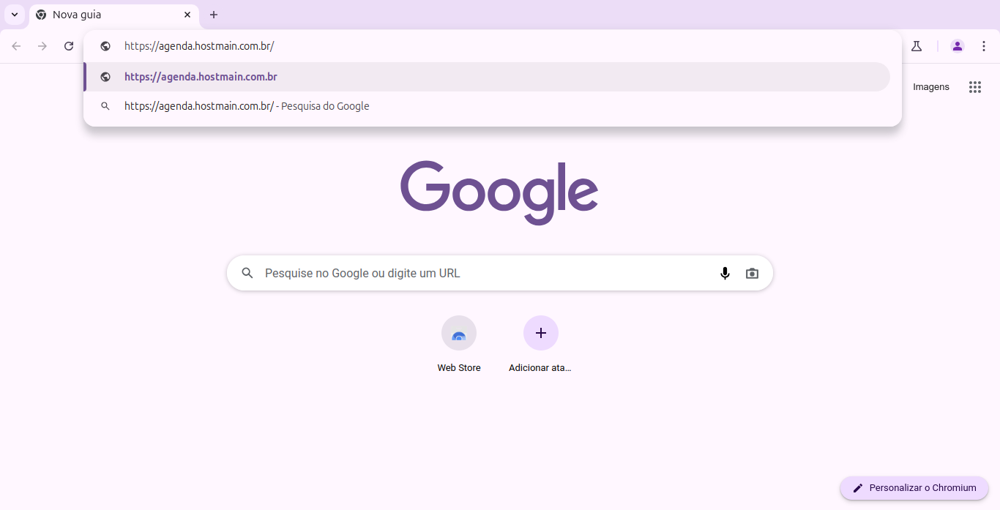
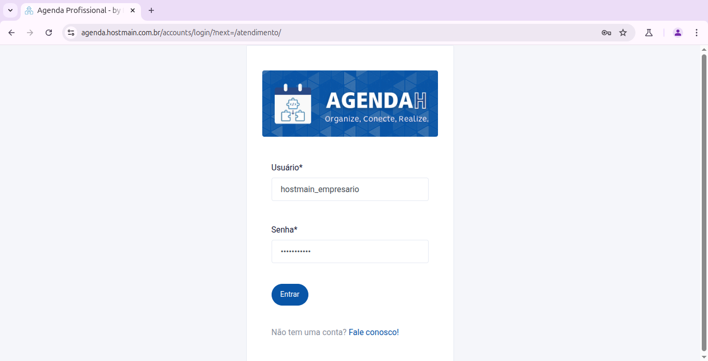

# 📘 Login no sistema

> **Finalidade:**  
> Esta tela permite que o usuário acesse o sistema.

> **Pré-requisitos:**   
> - Ter conexão com a internet

---

## 🧭 Etapas para uso

### 1. Acesso à funcionalidade 
- No seu navegador, digite (https://agenda.hostmain.com.br/)
- Isso retornará a tela de login do sistema

---

### 2. Preenchimento de dados
Preencha os campos:
- **Usuário**: insira o seu nome de usuário
- **Senha**: insira a sua senha

---

### 3. Ações disponíveis
Para validar seu login clique em:
- **Entrar**: verifica as informações inseridas e concede o acesso ao sistema  
- **Fale conosco!**: caso não possua as informações de usuário e senha, será redirecionado para o contato da empresa

---

### 4. Validações e mensagens
Ao tentar logar com informações de usuário erradas o sistema não avançará para a próxima tela

---

## 🔄 Versões e Atualizações

- **Versão 1.0** – Documento criado em 15/04/2025

---