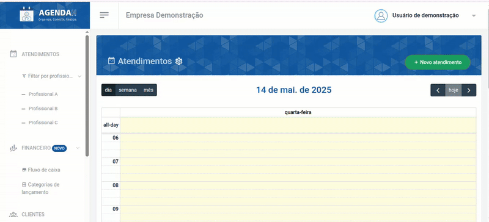
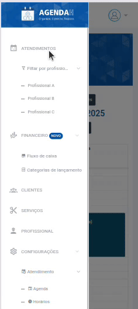
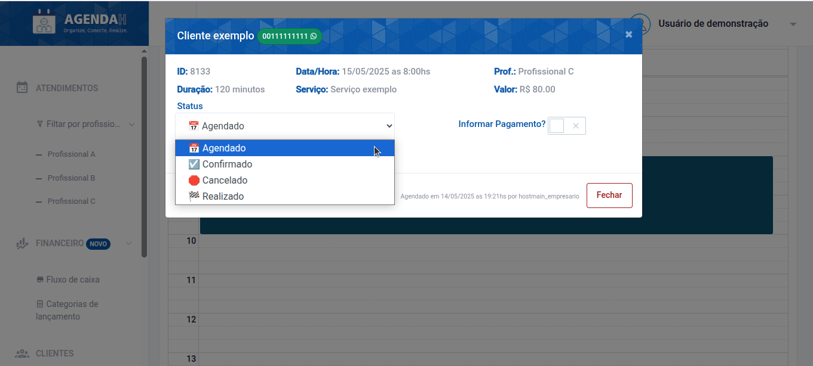
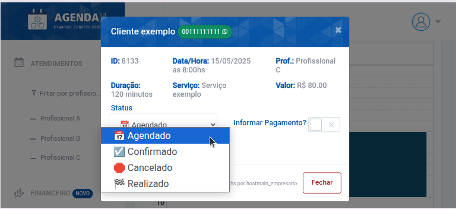

# 📘 Mudar status do atendimento

> **Finalidade:**  
> Esta tela permite ao usuário mudar os status do atendimento cadastrado

> **Pré-requisitos:**    
> - Estar logado no sistema  
> - Ter permissão de usuário(empresário) 
> - Ter conexão com a internet
> - Ter um atendimento cadastrado
> - [Clique para saber como cadastrar um novo atendimento](../novo_atendimento/readme.md)

---

## 🧭 Etapas para uso

### 1. Acesso à funcionalidade
- No menu lateral, clique em **Atendimentos**
- O sistema retornará a agenda do dia corrente, contendo todos os atendimentos cadastrados
- Selecione o atendimento cadastrado que deseja visualizar
- O sistema retornará uma página com o nome do cliente e as informações do atendimento

> Versão desktop

> Versão mobile

---

### 2. Ações disponíveis
Ao selecionar o atendimento, indique o status do atendimento, conforme a necessidade:

- Agendado (Para agendar)
- Confirmado (Para confirmar o agendamento)
- Cancelado (Para cancelar o atendimento, tornando o horário e profissional disponíveis para que outro cliente solicite)
- Realizado (Para indicar que o serviço foi realizado)

> Versão desktop

> Versão mobile

---

### 4. Validações e mensagens
- Ao atualizar o campo status: `Tudo certo! Status do atendimento atualizado com sucesso!`  

---

## 🔄 Versões e Atualizações

- **Versão 1.0** – Documento criado em 15/04/2025

---
