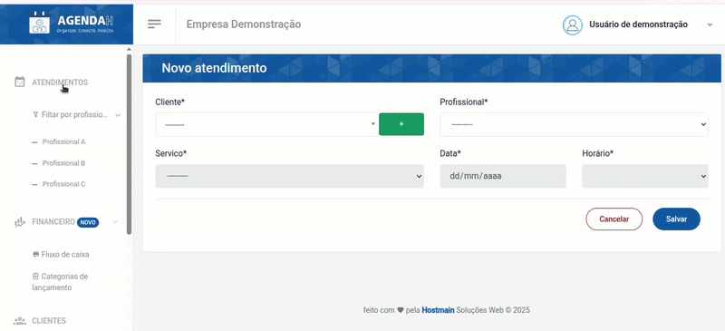
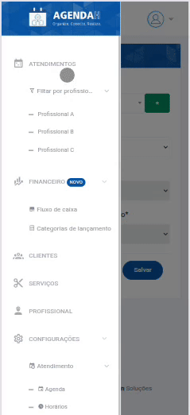
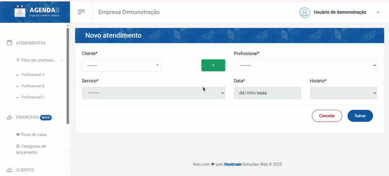
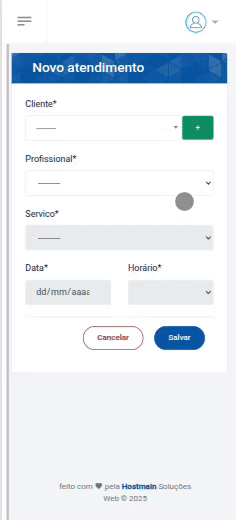
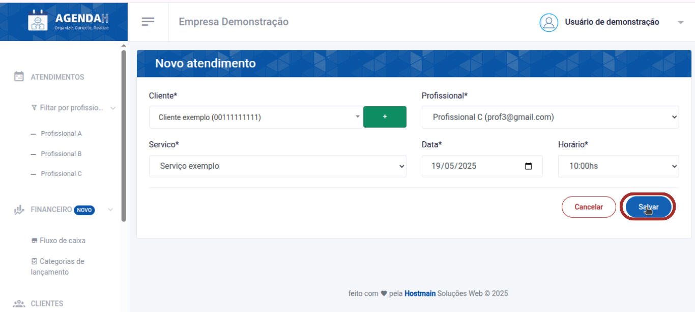
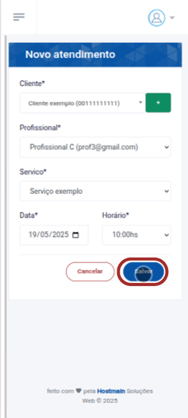

# 📘 Cadastrar novo Atendimento

> **Finalidade:**  
> Esta tela permite ao usuário cadastrar um novo atendimento a ser realizado.

> **Pré-requisitos:**    
> - Estar logado no sistema  
> - Ter permissão de usuário(empresário) 
> - Ter conexão com a internet
> - Ter um cliente cadastrado
> - Ter um profissional cadastrado 
> - Ter um serviço cadastrado
> - Veja detalhes de como cadastrar clientes, profissionais ou serviços em:
> - [Novo cliente](../../clientes/novo_cliente/readme.md)
> - [Novo profissional](../../profissional/novo_profissional/readme.md)
> - [Novo serviço](../../servico/novo_servico/readme.md)

---

## 🧭 Etapas para uso

### 1. Acesso à funcionalidade
- No menu lateral, clique em **Atendimentos**
- Em seguida, clique em **Novo atendimento**

> Versão desktop

> Versão mobile

---

### 2. Preenchimento de dados
Preencha os campos:
- **Cliente**: informe o cliente que solicitou o serviço (obrigatório)
>  Caso seja um cliente que não está cadastrado, clique no ícone **+** para realizar o cadastro e dar prosseguimento ao agendamento
- Versão desktop

- Versão mobile

Preencha também os campos: 
- **Profissional**: informe o profissional que irá realizar o serviço (obrigatório)
- **Serviço**: informe o serviço a ser realizado (obrigatório)
- **Data**: informe a data do agendamento (obrigatório)
- **Horário**: informe o horário do agendamento (obrigatório)
- Clique em **Salvar**

> Versão desktop

> Versão mobile

---

### 3. Ações disponíveis
- **+** : redireciona para a tela de cadastrar novo cliente
- **Salvar**: grava os dados preenchidos  
- **Cancelar**: cancela as alterações e volta à tela anterior  

---

### 4. Validações e mensagens
- Ao tentar salvar sem preencher algum campo do formulário: `Preencha este campo`  
- Após salvar com sucesso: `Atendimento agendado com sucesso!`  

---

### 5. Dicas e observações
> 💡 Só é possível indicar o serviço a ser realizado ao informar o profissional que irá realizá-lo

---

## 🔄 Versões e Atualizações

- **Versão 1.0** – Documento criado em 15/04/2025

---
