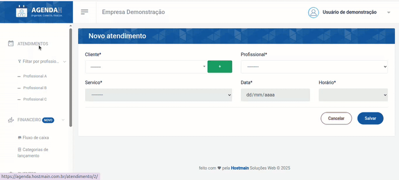
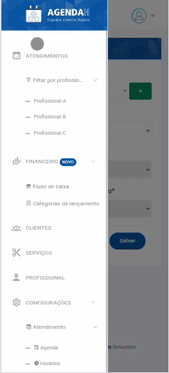

# 📘 Visualizar atendimentos

> **Finalidade:**  
> Esta tela permite ao usuário visualizar os atendimentos cadastrados

> **Pré-requisitos:**    
> - Estar logado no sistema  
> - Ter permissão de usuário(empresário) 
> - Ter conexão com a internet
> - Ter um atendimento cadastrado
> - [Clique para saber como cadastrar um novo atendimento](../novo_atendimento/readme.md)

---

## 🧭 Etapas para uso

### 1. Acesso à funcionalidade
- No menu lateral, clique em **Atendimentos**
- O sistema retornará a agenda do dia corrente, contendo todos os atendimentos cadastrados
- O usuário pode selecionar o formato de visualização da agenda, seja por dia, semana ou mês

> Versão desktop

> Versão mobile

---

## 🔄 Versões e Atualizações

- **Versão 1.0** – Documento criado em 15/04/2025

---
