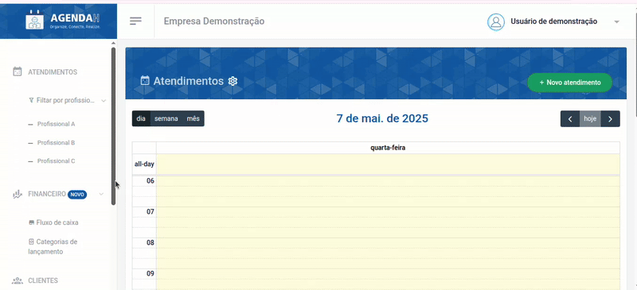
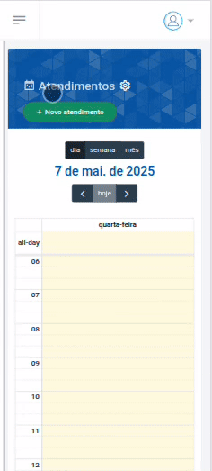
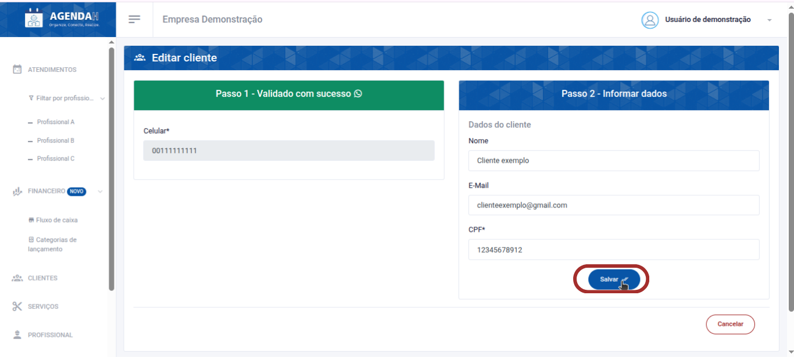
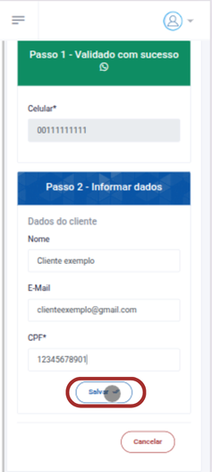

# 📘 Editar Cliente

> **Finalidade:**  
> Esta tela permite ao usuário editar os dados do cliente cadastrado.

> **Pré-requisitos:**    
> - Estar logado no sistema  
> - Ter permissão de usuário(empresário) 
> - Ter conexão com a internet
> - Ter um cliente cadastrado
> - [Clique aqui para saber como cadastrar um novo cliente](../novo_cliente/readme.md)

---

## 🧭 Etapas para uso

### 1. Acesso à funcionalidade
- No menu lateral, clique em **Clientes**
- Na tela de **Clientes**, clique no ícone da **caneta** que aparece ao lado direito do cliente que você deseja editar, na aba ações
- Ao realizar isso, você será direcionado a tela **Editar cliente**

> Versão Desktop

> Versão mobile

---

### 2. Preenchimento de dados
Preencha os campos que deseja alterar:
- **Nome**: informe um novo nome para o cliente
- **E-mail**: informe um novo e-mail
- **CPF**: informe um novo CPF 
- Clique em **Salvar**

> Versão Desktop

> Versão mobile

---

### 3. Ações disponíveis 
- **Salvar**: grava os dados preenchidos  
- **Cancelar**: cancela as alterações e volta à tela anterior  

---

### 4. Validações e mensagens
- Após salvar com sucesso: `Cliente atualizado com sucesso!`  

---

## 🔄 Versões e Atualizações

- **Versão 1.0** – Documento criado em 15/04/2025

---
