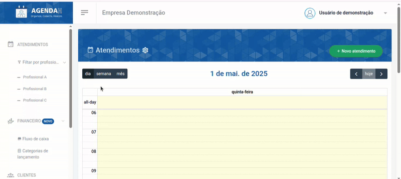
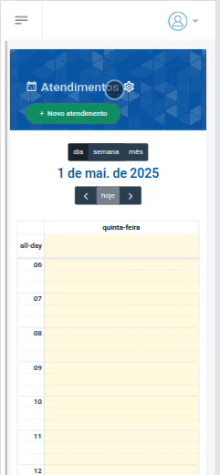
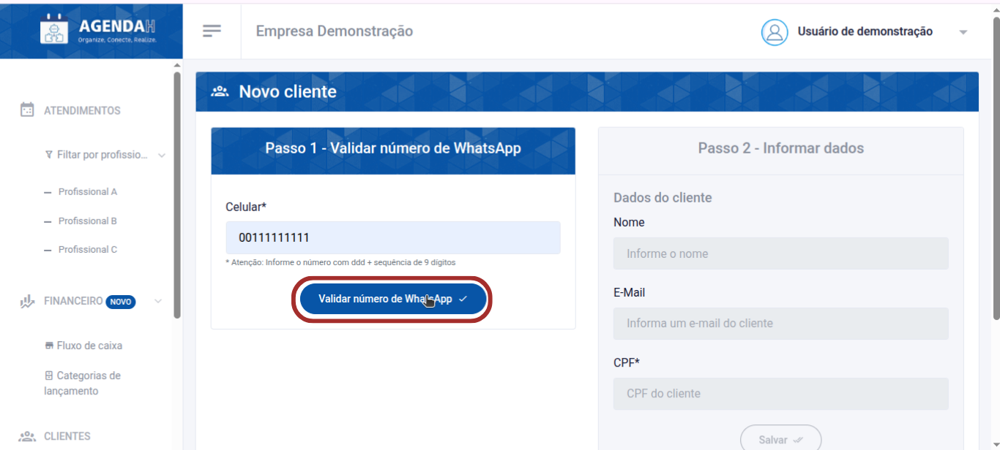
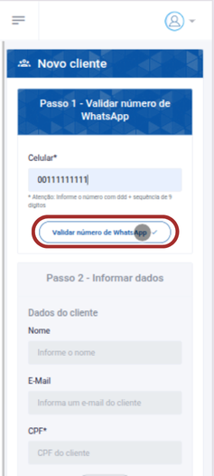
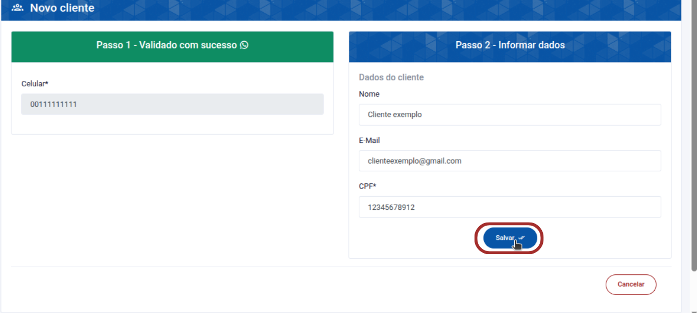
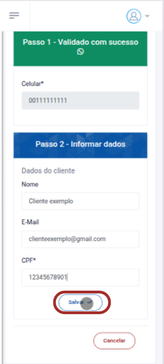

# 📘 Cadastrar novo Cliente

> **Finalidade:**  
> Esta tela permite ao usuário cadastrar um novo cliente.

> **Pré-requisitos:**    
> - Estar logado no sistema  
> - Ter permissão de usuário(empresário) 
> - Ter conexão com a internet
> - Veja detalhes de como editar ou excluir um cliente cadastrado em:  
> - [Editar cliente](../editar_cliente/readme.md)
> - [Excluir cliente](../editar_cliente/readme.md)

---

## 🧭 Etapas para uso

### 1. Acesso à funcionalidade
- No menu lateral, clique em **Clientes**
- Em seguida, clique em **Novo Cliente**

> Versão desktop

> Versão mobile

---

### 2. Preenchimento de dados
Passo 1 - Validar número de WhatsApp
- **E-mail**: informe o número de WhatsApp do cliente para que seja validado
- Em seguida, clique em **validar número de WhatsApp**

> Versão desktop

> Versão mobile

Passo 2 - Informar dados
- **Nome**: insira o nome do cliente  
- **E-mail**: insira o e-mail do cliente
- **CPF** (obrigatório): insira um CPF válido do cliente
- Clique em **Salvar**

> Versão desktop

> Versão mobile

---

### 3. Ações disponíveis
- **Validar número de WhatsApp**: grava o número preenchido e realiza a validação
- **Salvar**: grava os dados preenchidos  
- **Cancelar**: cancela as alterações e volta à tela anterior  

---

### 4. Validações e mensagens
- Se o número de WhatsApp informado na validação for um já existente no banco de dados: `O celular informado ("") já está cadastrado como um cliente deste estabelecimento.`
- Se o número de WhatsApp informado não seguir o padrão exigido (ddd+ sequência de 9 dígitos): `Número de celular Inválido`e `Não foi possível validar esse número.`
- Ao tentar salvar sem preencher algum campo do formulário: `Preencha este campo`  
- Após salvar com sucesso: `Cliente cadastrado com sucesso!`  

---

### 5. Dicas e observações
> 💡 Dica: insira um número de WhatsApp de acordo com o padrão: ddd+ sequência de 9 dígitos 

---

## 🔄 Versões e Atualizações

- **Versão 1.0** – Documento criado em 15/04/2025

---
