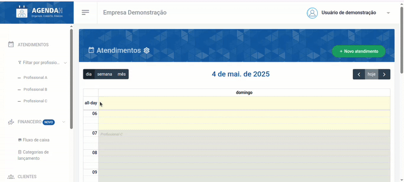
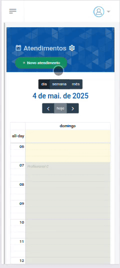
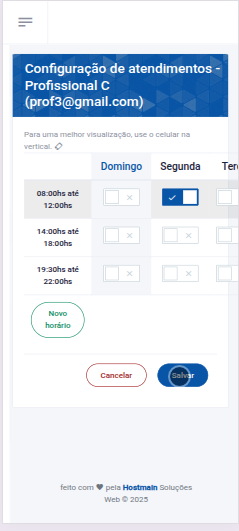

# 📘 Configurar agenda 

> **Finalidade:**  
> Esta tela permite ao usuário definir os horários de atendimento de cada profissional cadastrado.

> **Pré-requisitos:**    
> - Estar logado no sistema  
> - Ter permissão de usuário(empresário) 
> - Ter conexão com a internet

---

## 🧭 Etapas para uso

### 1. Acesso à funcionalidade
- No menu lateral, clique em **Configurações**
- O menu será expandido para as configurações de atendimento
- Em seguida, clique em **Agenda**
- O sistema retornará uma página com os profissionais cadastrados
- Clique em **Dias/horários**, você será direcionado à página que contém os horários de atendimento do profissional escolhido
- Posteriormente, clique em **Configurar**

> Versão desktop

> Versão mobile

---

### 2. Preenchimento de dados
Os horários de funcionamento do estabelecimento são indicados na página **Horários**, portanto os horários que aparecem página **Agenda** são com base neles.
Selecione os horários em que o profissional prestará serviços:

- Clique no ícone de ativação, para tornar o horário disponível para o cliente solicitá-lo, observe que é possível escolher os horários conforme o dia. Em caso de desativar, apenas repita o processo

> Versão desktop

> Versão mobile

---

### 3. Ações disponíveis
- **Ícone de ativação**: torna o horário disponível para agendamento
- **Novo horário**: redireciona o usuário para a página **Novo horário de atendimento** para caso queira adicionar um novo horário de atendimento
- **Salvar**: grava os dados preenchidos  
- **Cancelar**: descarta alterações e volta à tela anterior  

---

### 4. Validações e mensagens
- Após salvar com sucesso: `Configuração realizada com sucesso!`  

---

### 5. Dicas e observações
> 💡 Dica: caso queira adicionar um novo horário de funcionamento do estabelecimento, clique no ícone **Novo horário** 

---

## 🔄 Versões e Atualizações

- **Versão 1.0** – Documento criado em 15/04/2025

---
