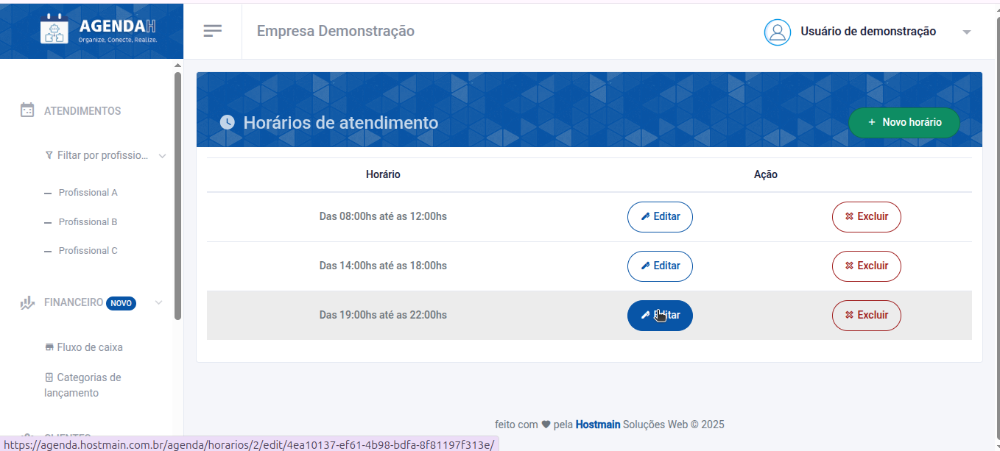
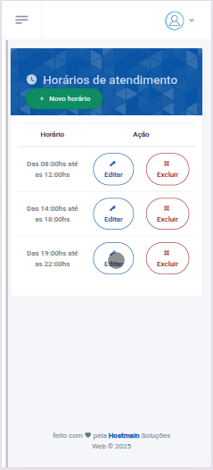
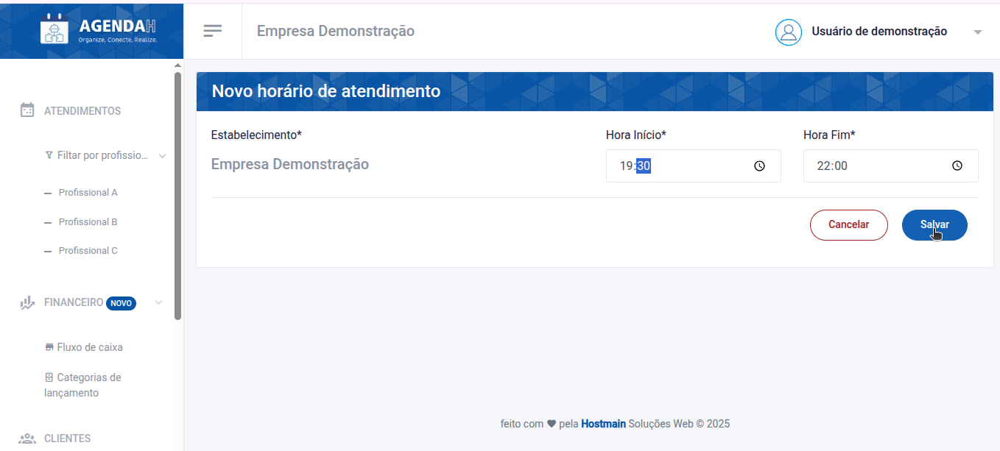
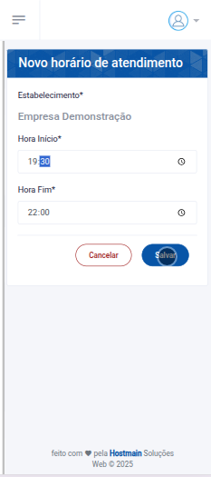

# 📘 Editar Horário de atendimento

> **Finalidade:**  
> Esta tela permite ao usuário editar os horários de atendimento cadastrados.

> **Pré-requisitos:**    
> - Estar logado no sistema  
> - Ter permissão de usuário(empresário) 
> - Ter conexão com a internet

---

## 🧭 Etapas para uso

### 1. Acesso à funcionalidade
-  No menu lateral, clique em **Configurações**
- O menu será expandido para as configurações de atendimento
- Em seguida, clique em **Horários**
- Na tela **Horários de atendimento**, clique no ícone da **caneta** que aparece ao lado direito do horário que você deseja editar
-  Ao realizar isso, você será direcionado a tela, na qual poderá editar o horário de atendimento

> Versão Desktop

> Versão mobile

---

### 2. Preenchimento de dados
Em **Novo horário de atendimento** digite um novo horário de início do atendimento(Obrigatório) e o novo horário final(Obrigatório)
- Clique em **Salvar**

> Versão Desktop

> Versão mobile

---

### 3. Ações disponíveis 
- **Salvar**: grava os dados preenchidos  
- **Cancelar**: descarta alterações e volta à tela anterior  

---

### 4. Validações e mensagens
- Após salvar com sucesso: `Horário atualizado com sucesso!`  

---

## 🔄 Versões e Atualizações

- **Versão 1.0** – Documento criado em 15/04/2025

---
