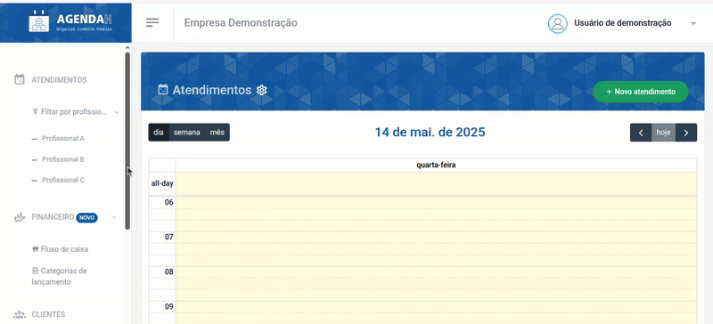
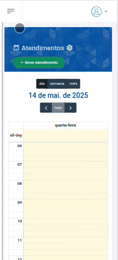
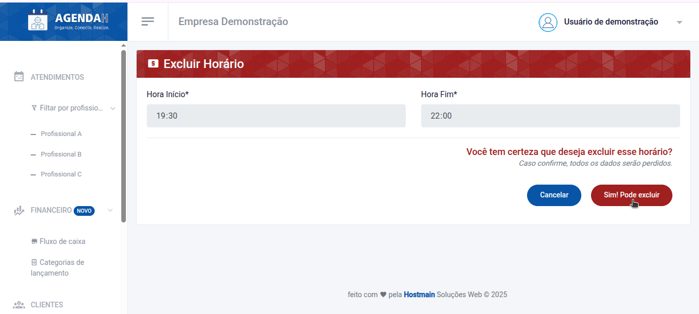
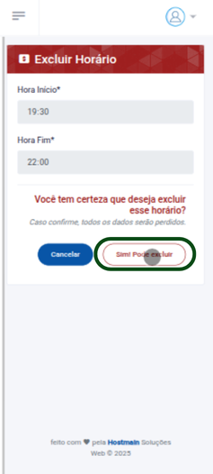

# 📘 Excluir Horário de atendimento

> **Finalidade:**  
> Esta tela permite ao usuário excluir os horários de atendimento cadastrados.

> **Pré-requisitos:**    
> - Estar logado no sistema  
> - Ter permissão de usuário(empresário) 
> - Ter conexão com a internet
> - Ter horário de atendimento cadastrado
> - [Clique aqui para saber como cadastrar um novo horário](../novo_horario/readme.md)

---

## 🧭 Etapas para uso

### 1. Acesso à funcionalidade 
-  No menu lateral, clique em **Configurações**
- O menu será expandido para as configurações de atendimento
- Em seguida, clique em **Horários**
- Na tela **Horários de atendimento**, clique no ícone **X** que aparece ao lado direito do horário que você deseja excluir, na aba ações
- Ao realizar essa ação, você será direcionado à tela **Excluir Horário**

> Versão Desktop

> Versão mobile

---

### 2. Ações disponíveis 
- **Sim! Pode excluir**: caso escolha essa opção, os dados do horário cadastrado serão permanentemente excluídos
- **Cancelar**: cancela a ação e volta à tela anterior  

> Versão Desktop

> Versão mobile

---

### 3. Validações e mensagens
- Após excluir com sucesso: `Horário deletado com sucesso!`  

---

## 🔄 Versões e Atualizações

- **Versão 1.0** – Documento criado em 15/04/2025

---
