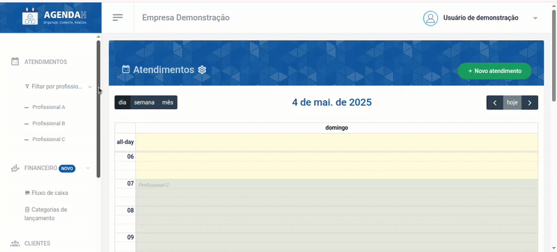
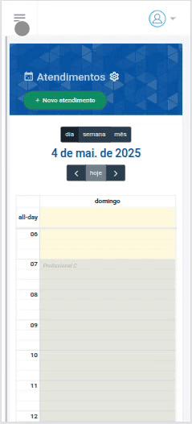
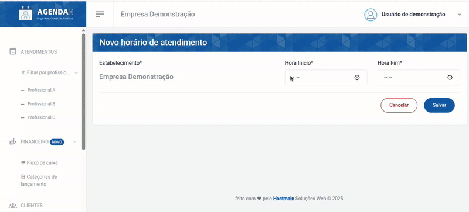

# 📘 Configurar horários de atendimento do estabelecimento

> **Finalidade:**  
> Esta tela permite ao usuário definir os horários de atendimento do estabelecimento.

> **Pré-requisitos:**    
> - Estar logado no sistema  
> - Ter permissão de usuário(empresário) 
> - Ter conexão com a internet
> - Veja detalhes de como editar ou excluir um horário cadastrado em:  
> - [Editar horário](../editar_horario/readme.md)
> - [Excluir horário](../excluir_horario/readme.md)

---

## 🧭 Etapas para uso

### 1. Acesso à funcionalidade
- No menu lateral, clique em **Configurações**
- O menu será expandido para as configurações de atendimento
- Em seguida, clique em **Horários**
- O sistema retornará uma página com os horários cadastrados
- Em seguida, clique em **Novo horário**

> Versão desktop

> Versão mobile

---

### 2. Preenchimento de dados
Em **Novo horário de atendimento** digite:
- O horário de início do atendimento(Obrigatório)
- E o horário final(Obrigatório)
- Clique em **Salvar**

> Versão desktop

> Versão mobile

---

### 3. Ações disponíveis
- **Salvar**: grava os dados preenchidos  
- **Cancelar**: cancela as alterações e volta à tela anterior  

---

### 4. Validações e mensagens
- Após salvar com sucesso: `Horário adicionado com sucesso!`  

---

## 🔄 Versões e Atualizações

- **Versão 1.0** – Documento criado em 15/04/2025

---
