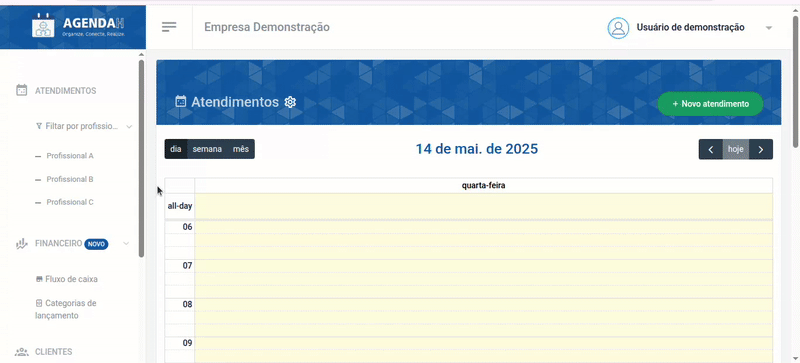
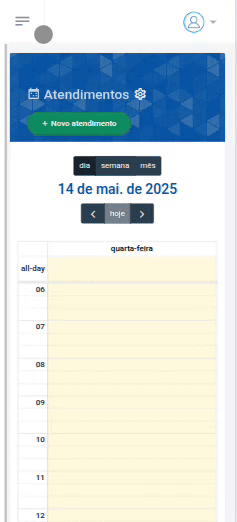
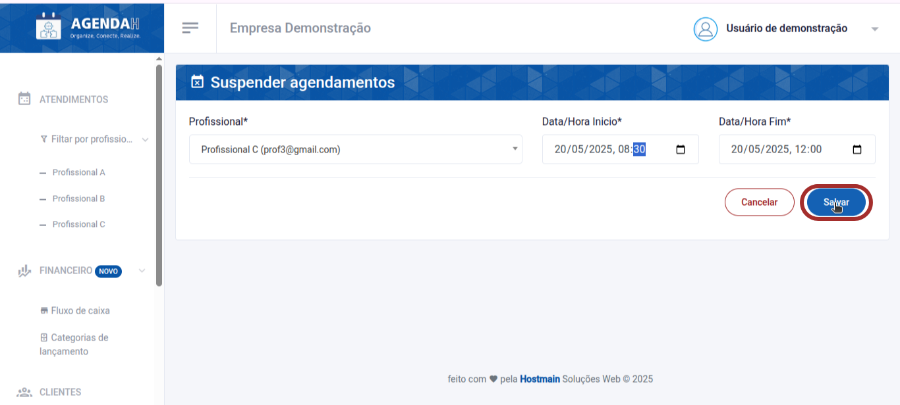
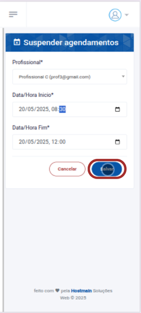

# 📘 Editar Horário suspenso

> **Finalidade:**  
> Esta tela permite ao usuário editar os horários suspensos de atendimento cadastrados.

> **Pré-requisitos:**    
> - Estar logado no sistema  
> - Ter permissão de usuário(empresário) 
> - Ter conexão com a internet
> - Ter um horário suspenso cadastrado
> - [Clique aqui para saber como suspender o horário de atendimento de um profissional](../suspender_horario/readme.md)

---

## 🧭 Etapas para uso

### 1. Acesso à funcionalidade
- No menu lateral, clique em **Configurações**
- O menu será expandido para as configurações de atendimento
- Em seguida, clique em **Suspensos**
- Na tela de **Hoŕarios suspensos**, clique no ícone da **caneta** que aparece ao lado direito do cliente que você deseja editar
-  Ao realizar isso, você será direcionado a tela, na qual poderá editar o horário suspenso de agendamento

> Versão Desktop

> Versão mobile

---

### 2. Preenchimento de dados
Em **Suspender agendamentos**, indique:
- Um novo profissional que terá o horário suspenso
- Informe uma nova data e um novo horário de inicio e fim da suspensão
- Clique em **Salvar**

> Versão Desktop

> Versão mobile

---

### 3. Ações disponíveis 
- **Salvar**: grava os dados preenchidos  
- **Cancelar**: cancela as alterações e volta à tela anterior  

---

### 4. Validações e mensagens
- Após salvar com sucesso: `Atendimento suspenso editado com sucesso!`  

---

## 🔄 Versões e Atualizações

- **Versão 1.0** – Documento criado em 15/04/2025

---
