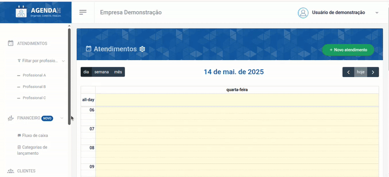
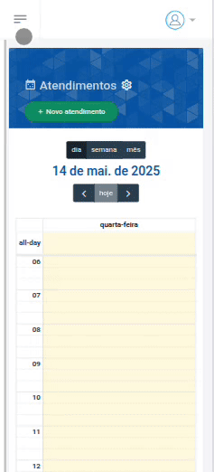

# 📘 Excluir Horário suspenso de agendamento

> **Finalidade:**  
> Esta tela permite ao usuário excluir os horários suspensos de atendimento cadastrados.

> **Pré-requisitos:**    
> - Estar logado no sistema  
> - Ter permissão de usuário(empresário) 
> - Ter conexão com a internet
> - Ter um horário suspenso cadastrado
> - [Clique aqui para saber como suspender o horário de atendimento de um profissional](../suspender_horario/readme.md)

---

## 🧭 Etapas para uso

### 1. Acesso à funcionalidade 
- No menu lateral, clique em **Configurações**
- O menu será expandido para as configurações de atendimento
- Em seguida, clique em **Suspensos**
- O sistema retornará a página com os profissionais cadastrados e seus respectivos horários suspensos, com data/hora de início e fim

---

### 2. Ações disponíveis 
- Na tela **Horários suspensos**, clique no ícone **X** que aparece ao lado direito do horário suspenso que você deseja excluir, esta ação irá excluir definitivamente a suspensão de horário
- Portanto, o horário voltará a ficar disponível para que os clientes façam o agendamento

> Versão Desktop

> Versão mobile

---

### 3. Validações e mensagens
- Após excluir com sucesso: `Suspensão de atendimento deletado com sucesso!`  

---

## 🔄 Versões e Atualizações

- **Versão 1.0** – Documento criado em 15/04/2025

---
