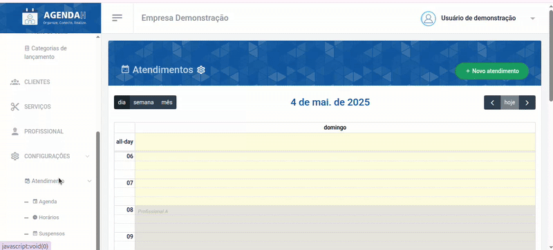
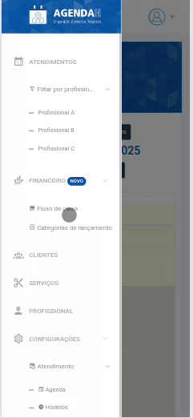
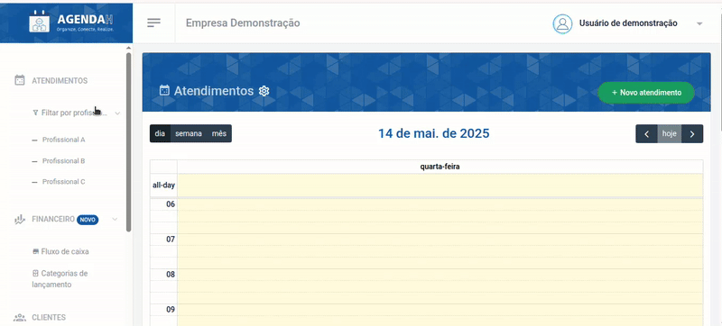
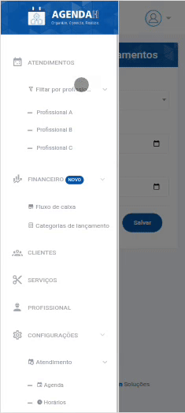
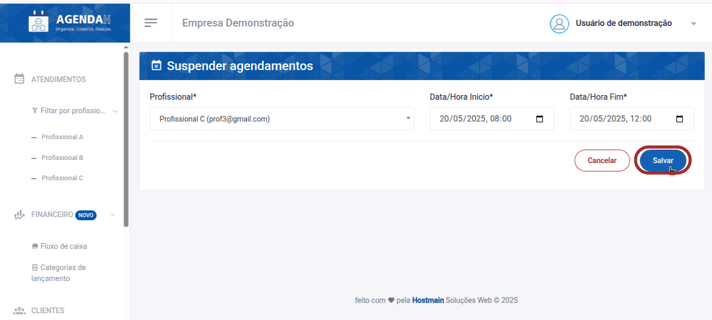
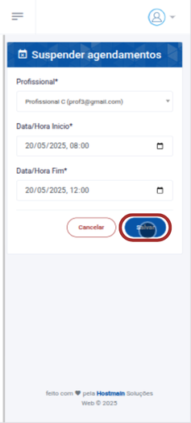

# 📘 Suspender Horário de atendimento do profissional

> **Finalidade:**  
> Esta tela permite ao usuário suspender o atendimento de cada profissional cadastrado individualmente, por tempo determinado.

> **Pré-requisitos:**    
> - Estar logado no sistema  
> - Ter permissão de usuário(empresário) 
> - Ter conexão com a internet
> - Ter um profissional cadastrado
> - [Clique aqui para saber como cadastrar um novo profissional](../../../profissional/novo_profissional/readme.md)

---

## 🧭 Etapas para uso

### 1. Acesso à funcionalidade
- No menu lateral, clique em **Configurações**
- O menu será expandido para as configurações de atendimento
- Em seguida, clique em **Suspensos**
- O sistema retornará uma página com os horários já suspensos
- Clique em **Suspender horário**

> Versão desktop

> Versão mobile

**Ou**

- No menu lateral, clique em **Atendimentos**
- Em seguida, clique no ícone da engrenagem 
- O sistema retornará a página **Suspender agendamentos**

> Versão desktop

> Versão mobile

---

### 2. Preenchimento de dados
Em **Suspender agendamentos**, indique:
- O profissional que terá o horário suspenso
- Informe a data e o horário de inicio e fim da suspensão
- Clique em **Salvar**

> Versão desktop

> Versão mobile

---

### 3. Ações disponíveis
- **Salvar**: grava os dados preenchidos  
- **Cancelar**: cancela as alterações e volta à tela anterior  

---

### 4. Validações e mensagens
- Caso a data/hora de fim for antes da data/hora de inicio especificada: `A data/hora de fim deve ser após à data/hora de inicio`
- Após salvar com sucesso: `Atendimento suspenso com sucesso!`  

---

### 5. Dicas e observações
> 💡 Dica: adicione sempre um horário que vem depois da data de inicio da suspensão

---

## 🔄 Versões e Atualizações

- **Versão 1.0** – Documento criado em 15/04/2025

---
