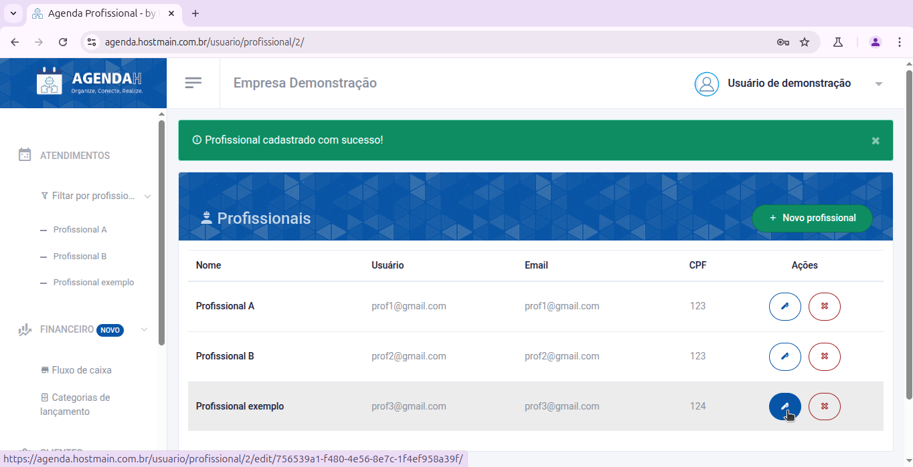
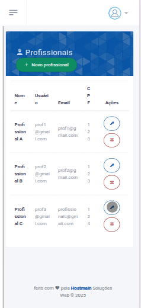
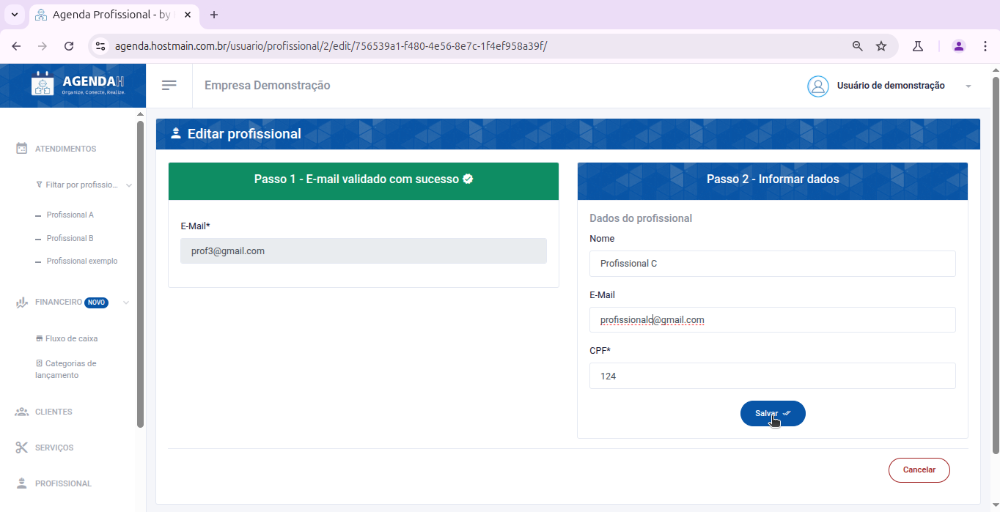
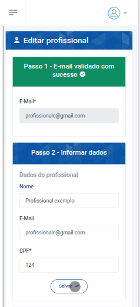

# 📘 Editar profissional

> **Finalidade:**  
> Esta tela permite ao usuário editar os dados do profissional cadastrado.

> **Pré-requisitos:**    
> - Estar logado no sistema  
> - Ter permissão de usuário(empresário) 
> - Ter conexão com a internet

---

## 🧭 Etapas para uso

### 1. Acesso à funcionalidade
- No menu lateral, clique em **Profissional**
- Na tela de **Profissionais**, clique no ícone da **caneta** que aparece ao lado direito do profissional que você deseja editar
- Ao realizar isso, você será direcionado a tela **Editar profissional**

> Versão Desktop

> Versão mobile

---

### 2. Preenchimento de dados
Preencha os campos que deseja alterar:
- **Nome**: informe um novo nome
- **E-mail**: informe um novo e-mail para o profissional
- **CPF**: informe um novo CPF e uma senha forte
- Clique em **Salvar**

> Versão Desktop

> Versão mobile

---

### 3. Ações disponíveis 
- **Salvar**: grava os dados preenchidos  
- **Cancelar**: descarta alterações e volta à tela anterior  

---

### 4. Validações e mensagens
- Após salvar com sucesso: `Profissional atualizado com sucesso!`  

---

## 🔄 Versões e Atualizações

- **Versão 1.0** – Documento criado em 15/04/2025
- **Versão 1.1** – Atualização de campos obrigatórios (20/04/2025)

---
