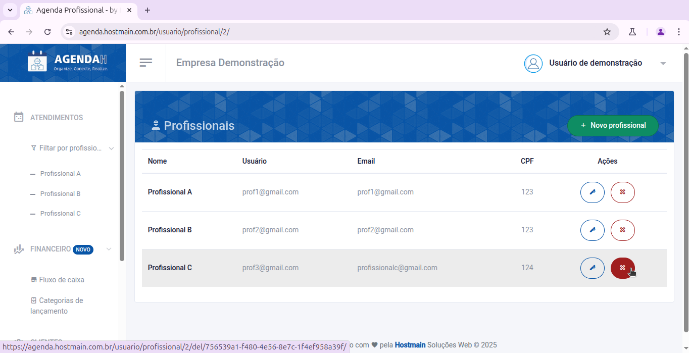
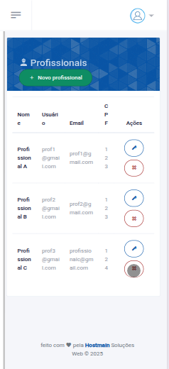
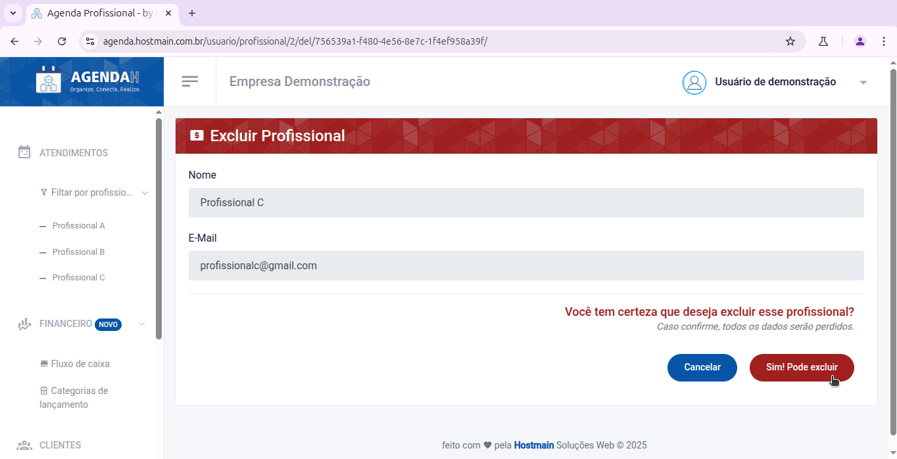
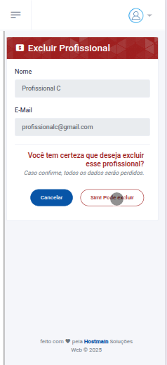

# 📘 Excluir profissional

> **Finalidade:**  
> Esta tela permite ao usuário excluir o profissional cadastrado.

> **Pré-requisitos:**    
> - Estar logado no sistema  
> - Ter permissão de usuário(empresário) 
> - Ter conexão com a internet

---

## 🧭 Etapas para uso

### 1. Acesso à funcionalidade 
- No menu lateral, clique em **Profissional**
- Na tela de **Profissionais**, clique no ícone **X** que aparece ao lado direito do profissional que você deseja excluir
- Ao realizar essa ação, você será direcionado a tela **Excluir Profissional**

> Versão Desktop

> Versão mobile

---

### 3. Ações disponíveis 
- **Sim! Pode excluir**: exclui os dados do profissional 
- **Cancelar**: descarta a ação e volta à tela anterior  

> Versão Desktop

> Versão mobile

---

### 4. Validações e mensagens
- Após excluir com sucesso: `Profissional removido com sucesso!`  

---

## 🔄 Versões e Atualizações

- **Versão 1.0** – Documento criado em 15/04/2025
- **Versão 1.1** – Atualização de campos obrigatórios (20/04/2025)

---
