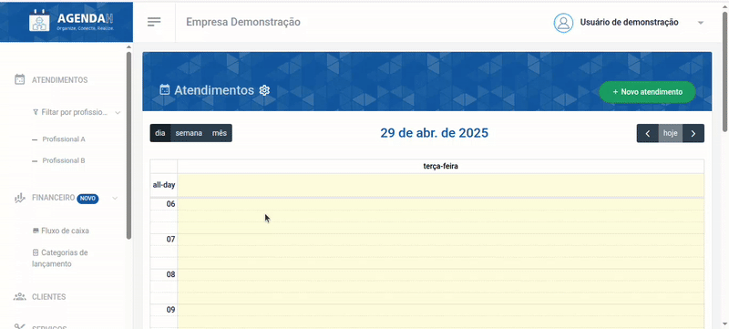
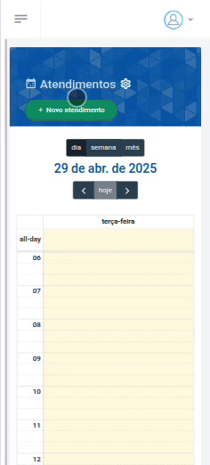
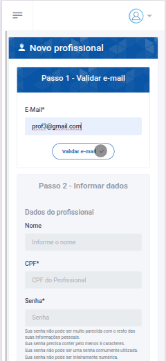
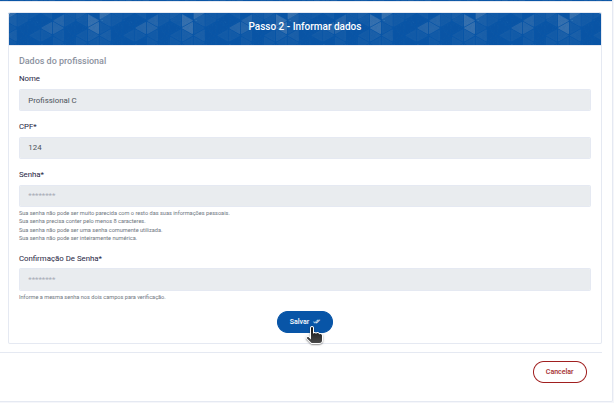
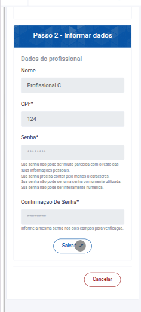

# 📘 Cadastrar novo Profissional

> **Finalidade:**  
> Esta tela permite ao usuário cadastrar um novo profissional.

> **Pré-requisitos:**    
> - Estar logado no sistema  
> - Ter permissão de usuário(empresário) 
> - Ter conexão com a internet

---

## 🧭 Etapas para uso

### 1. Acesso à funcionalidade
- No menu lateral, clique em **Profissional**
- Em seguida, clique em **Novo profissional**

> Versão desktop

> Versão mobile

---

### 2. Preenchimento de dados
Passo 1 - Validar e-mail
- **E-mail**: informe o e-mail do profissional para que seja validado
- Em seguida, clique em **validar e-mail**

> Versão desktop

> Versão mobile

Passo 2 - Informar dados
- **Nome**: insira o nome do profissional  
- **CPF** (obrigatório): insira um CPF válido
- **Senha** (obrigatório): insira uma senha forte
- **Confirmação de Senha** (obrigatório): insira novamente a senha criada para verificação 

> Versão desktop

> Versão mobile

---

### 3. Ações disponíveis
- **validar e-mail**: grava o e-mail preenchido e realiza a validação
- **Salvar**: grava os dados preenchidos  
- **Cancelar**: descarta alterações e volta à tela anterior  

---

### 4. Validações e mensagens
- Se o e-mail informado na validação for um já existente no banco de dados: `Este e-mail já existe em nossa base de dados. Clique em salvar para definir este usuário como profissional do seu estabelecimento.`
- Se ocorrer algum erro no preenchimento do formulário: `Erro ao validar o formulário. Verifique os campos e tente novamente.`
- Ao tentar salvar sem ter criado uma senha forte: `Esta senha é muito curta. Ela precisa conter pelo menos 8 caracteres. Esta senha é muito comum.`
- Se as senhas digitadas forem diferentes: `Os dois campos de senha não correspondem.`
- Ao tentar salvar sem preencher algum campo do formulário: `Preencha este campo`  
- Após salvar com sucesso: `Profissional cadastrado com sucesso!`  

---

### 5. Dicas e observações
> 💡 Dica: crie senhas fortes ao cadastrar um novo profissional.

---

## 🔄 Versões e Atualizações

- **Versão 1.0** – Documento criado em 15/04/2025
- **Versão 1.1** – Atualização de campos obrigatórios (20/04/2025)

---
