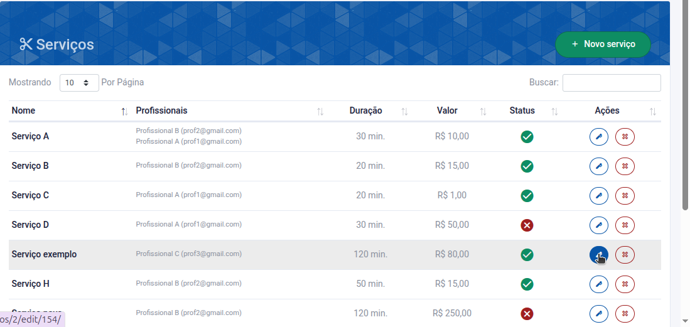
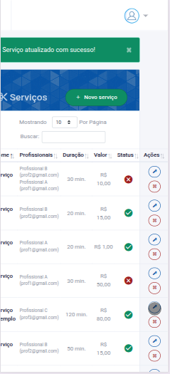
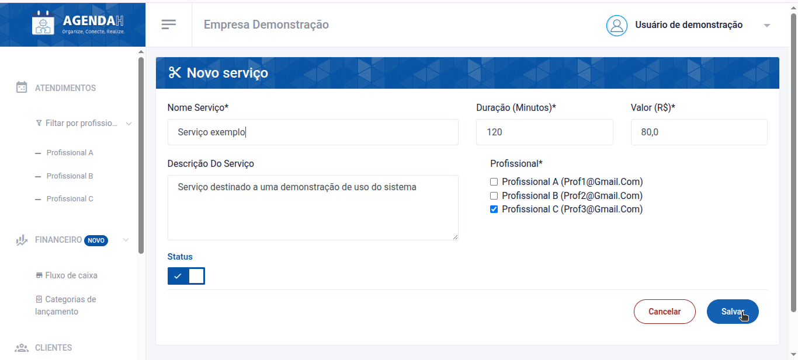
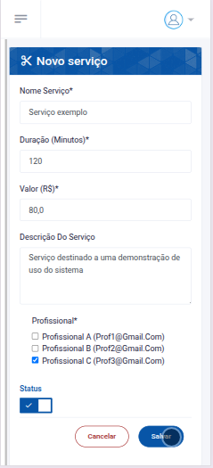

# 📘 Editar Serviço

> **Finalidade:**  
> Esta tela permite ao usuário editar os dados do serviço cadastrado.

> **Pré-requisitos:**  
> - Estar logado no sistema  
> - Ter permissão de usuário(empresário)  
> - Ter conexão com a internet

---

## 🧭 Etapas para uso

### 1. Acesso à funcionalidade
- No menu lateral, clique em **Serviços**
- Na tela de **Serviços**, clique no ícone da **caneta** que aparece ao lado direito do serviço que você deseja editar
- Ao realizar isso, você será direcionado a tela, na qual poderá editar as informações

> Versão Desktop

> Versão mobile

---

### 2. Preenchimento de dados
Preencha os campos que deseja alterar:
- **Nome Serviço**: informe um novo nome para o serviço
- **Duração (Minutos)**: informe uma nova duração 
- **Valor (R$)**: informe um novo valor
- **Descrição do Serviço**: informe uma nova descrição para o serviço
- **Profissional**: escolha um novo profissional

> Versão Desktop

> Versão mobile

---

### 3. Ações disponíveis
- **Status**: se ativado, torna o serviço disponível na página de **Serviços**, permitindo que os clientes o solicitem, já se estiver desativado torna-o indisponível  
- **Salvar**: grava os dados preenchidos  
- **Cancelar**: descarta alterações e volta à tela anterior  

---

### 4. Validações e mensagens
- Ao tentar salvar sem preencher os campos obrigatórios: `Este campo é obrigatório` ou `Preencha este campo`  
- Após salvar com sucesso: `Serviço atualizado com sucesso!`  

---

### 5. Dicas e observações (opcional)
> 💡 Dica: insira a duração do serviço em minutos, por exemplo: se o serviço dura 1 hora e 30 minutos, coloque 90 minutos.

---

## 🔄 Versões e Atualizações

- **Versão 1.0** – Documento criado em 
30/04/2025

---

