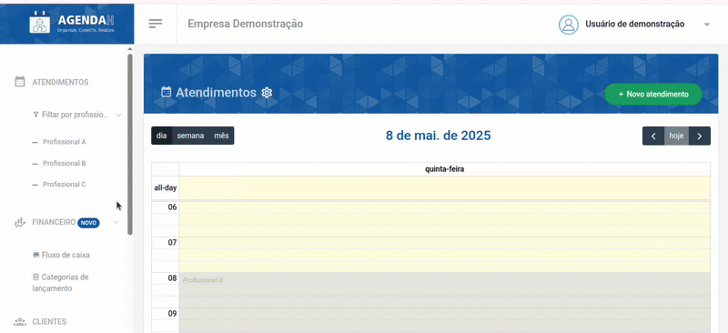
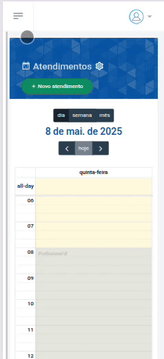
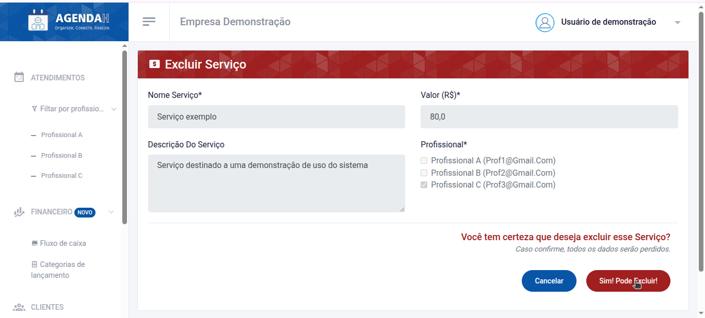
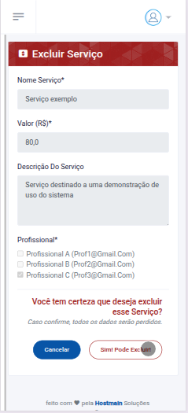

# 📘 Excluir Serviço

> **Finalidade:**  
> Esta tela permite ao usuário excluir o serviço cadastrado.

> **Pré-requisitos:**    
> - Estar logado no sistema  
> - Ter permissão de usuário(empresário) 
> - Ter conexão com a internet
> - Ter um serviço cadastrado
> - [Clique aqui para saber como cadastrar um novo serviço](../novo_servico/readme.md)

---

## 🧭 Etapas para uso

### 1. Acesso à funcionalidade 
- No menu lateral, clique em **Serviços**
- Na tela de **Serviços**, clique no ícone **X** que aparece ao lado direito do serviço que você deseja excluir, na barra ações
- Ao realizar essa ação, você será direcionado a tela **Excluir Serviço**

> Versão Desktop

> Versão mobile

---

### 2. Ações disponíveis 
- **Sim! Pode excluir**: exclui os dados do serviço 
- **Cancelar**: descarta a ação e volta à tela anterior  

> Versão Desktop

> Versão mobile

---

### 3. Validações e mensagens
- Após excluir com sucesso: `Serviço deletado com sucesso!`  

---

## 🔄 Versões e Atualizações

- **Versão 1.0** – Documento criado em 15/04/2025

---
