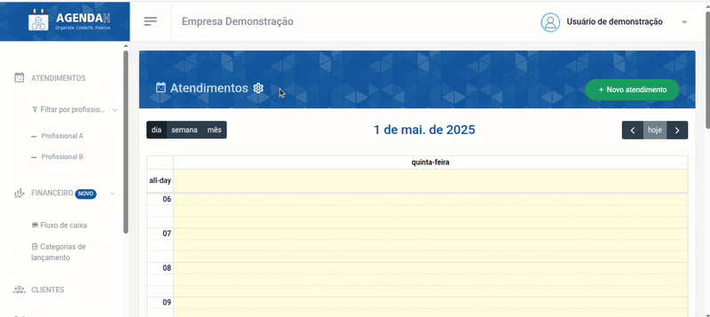
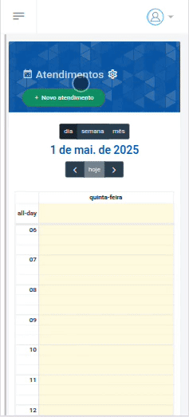
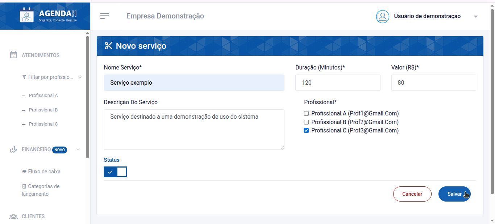
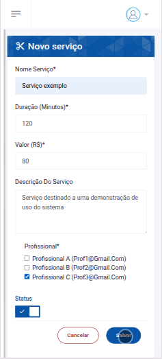

# 📘 Cadastrar novo serviço

> **Finalidade:**  
> Esta tela permite ao usuário cadastrar um novo serviço no sistema e direcioná-lo ao profissional que irá realizá-lo.

> **Pré-requisitos:**  
> - Estar logado no sistema  
> - Ter permissão de usuário(empresário)  
> - Ter conexão com a internet

---

## 🧭 Etapas para uso

### 1. Acesso à funcionalidade
- No menu lateral, clique em **Serviços**
- Em seguida, clique em **Novo Serviço** 

> Versão Desktop

> Versão mobile

---

### 2. Preenchimento de dados
Preencha os campos com as informações:
- **Nome Serviço**: insira o nome do serviço que deseja cadastrar (obrigatório)  
- **Duração (Minutos)**: insira o tempo que o serviço demora para ser executado em minutos
(obrigatório) 
- **Valor (R$)**: insira o valor que custa o serviço(obrigatório)
- **Descrição do Serviço**: para caso queira adicionar alguma informação sobre o serviço
- **Profissional**: assinale um ou mais profissionais que irão realizar o serviço
(obrigatório) 

> Versão Desktop

> Versão mobile

---

### 3. Ações disponíveis
- **Status**: se ativado, torna o serviço disponível na página de **Serviços**, permitindo que os clientes o solicitem, já se estiver desativado torna-o indisponível 
- **Salvar**: grava os dados preenchidos  
- **Cancelar**: descarta alterações e volta à tela anterior  

---

### 4. Validações e mensagens
- Ao tentar salvar sem preencher os campos obrigatórios: `Este campo é obrigatório` ou `Preencha este campo`  
- Após salvar com sucesso: `Serviço adicionado com sucesso!`  

---

### 5. Dicas e observações (opcional)
> 💡 Dica: insira a duração do serviço em minutos, por exemplo: se o serviço dura 1 hora e 30 minutos, coloque 90 minutos.

---

## 🔄 Versões e Atualizações

- **Versão 1.0** – Documento criado em 
30/04/2025

---

